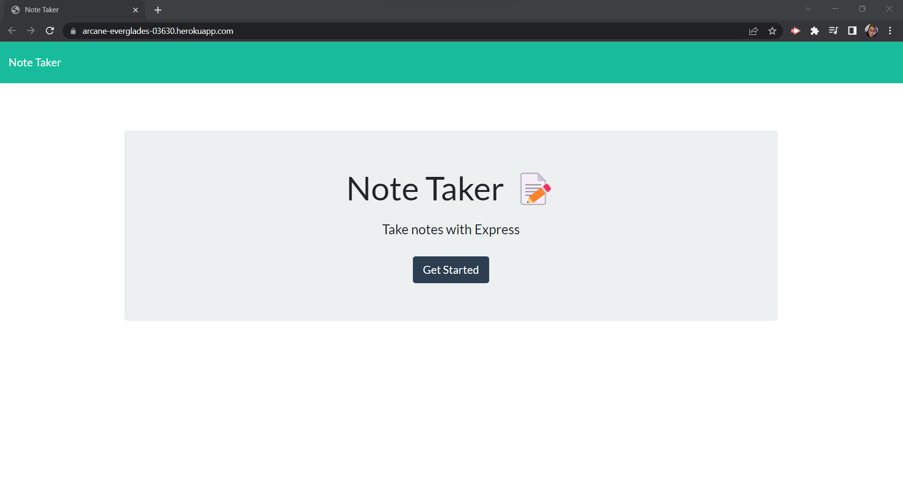
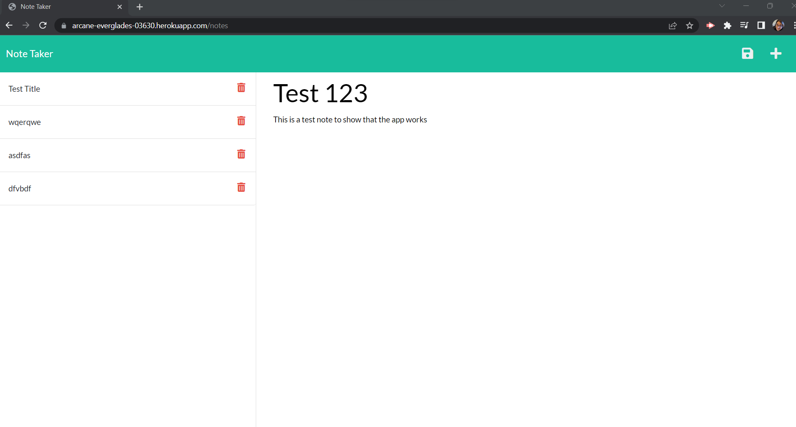
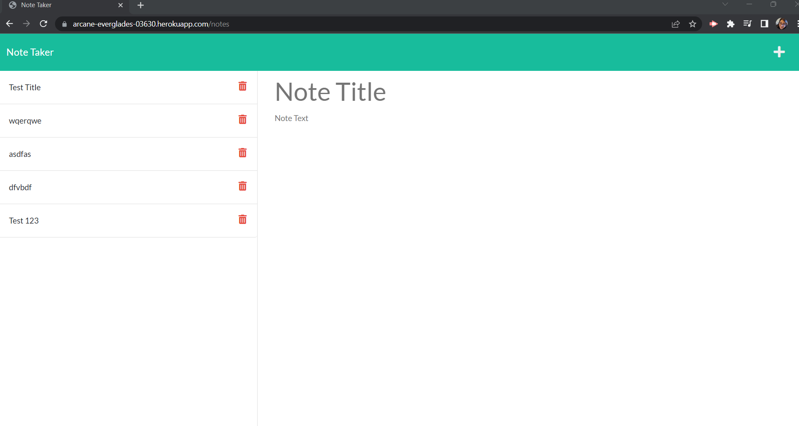

# Note Taker Starter Code

## Description

I want to be able to write and save notes. The application should be help organize my thoughts and keep track of tasks I need to complete. It should accomplish this in an intuitive interface that is easy to use.

## Table of Contents 

- [Installation](#installation)
- [Usage](#usage)
- [Credits](#credits)
- [License](#license)

## Installation

https://arcane-everglades-03630.herokuapp.com/ 

## Usage

A user will go to the listed site. The landing page will appear. The user will then click the "Get Started" button to begin. A new page will load that will list all saved notes on the left side of the page. New notes can be entered after clicking the plus symbol. The user will then enter a tile and body of the note. Once those fields have content a save button will appear. This button will then be clicked and the note will appear on the saved notes list on the right side.

## Credits

Kaz Nyborg-Andersen https://github.com/kaznyborg 

## License

MIT License

Copyright (c) [2023] [Kaz Nyborg-Andersen]

Permission is hereby granted, free of charge, to any person obtaining a copy
of this software and associated documentation files (the "Software"), to deal
in the Software without restriction, including without limitation the rights
to use, copy, modify, merge, publish, distribute, sublicense, and/or sell
copies of the Software, and to permit persons to whom the Software is
furnished to do so, subject to the following conditions:

The above copyright notice and this permission notice shall be included in all
copies or substantial portions of the Software.

THE SOFTWARE IS PROVIDED "AS IS", WITHOUT WARRANTY OF ANY KIND, EXPRESS OR
IMPLIED, INCLUDING BUT NOT LIMITED TO THE WARRANTIES OF MERCHANTABILITY,
FITNESS FOR A PARTICULAR PURPOSE AND NONINFRINGEMENT. IN NO EVENT SHALL THE
AUTHORS OR COPYRIGHT HOLDERS BE LIABLE FOR ANY CLAIM, DAMAGES OR OTHER
LIABILITY, WHETHER IN AN ACTION OF CONTRACT, TORT OR OTHERWISE, ARISING FROM,
OUT OF OR IN CONNECTION WITH THE SOFTWARE OR THE USE OR OTHER DEALINGS IN THE
SOFTWARE.
